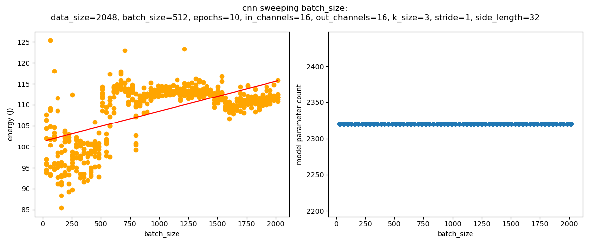

# Journal
Willow Cunningham

This document contains notes, thoughts, todos, etc considered in the development of the project. Read at your own risk.

## 3/29/2025

Installing pytorch to get started. On the broadwell machine, need to use apt. made the mistake of `sudo apt update && sudo apt upgrade`-ing, which apparently hasnt been done in a while. To install, will `sudo apt-get install python3-torch`.

Went ahead and installed on raptorlake while waiting. Now to download the examples from [pytorch/examples](https://github.com/pytorch/examples/tree/main)

Okay, so what I want to do actually is characterize individual *layers* and then we can just know what we are dealing with. That easy right?

As a first start, I created a script that can define a net that just has linear layers with a ton of parameters, and times it.
Next, I should make it into an importable function and set up an energy test fixture script

Now that I have a test fixture script going, there's one thing it really needs. A standardized way to save *all* state information from a run. Like, i can record the energy thats great. I also need to record the hyperparamters of the model I benched. As json?

First experiment: Changing the number of hidden layers and recording traaining energy. For epochs=1, nl from 1-10. averaged over n=10:

energy: [60.57, 61.43, 77.28, 80.65, 83.89, 85.89, 88.78, 87.04, 90.71, 91.96]

its, uh, *roughly* linenar..... lets try more averaging, more data

For -e=1, -nl=1 to 100, averaged over n=10:
[62.292658639999985, 60.88475836, 77.98110112, 80.42585936, 83.23783924000001, 85.98905048, 88.38566159999999, 90.53577384, 92.49160155999999, 93.11804204000002, 94.74342519999999, 96.78914560000001, 97.80206788, 98.00723628000001, 98.98897699999998, 102.25028564, 102.36446292000001, 102.36996588, 104.61792468, 101.16955088, 106.93908456000001, 107.68316652, 111.64754640000002, 110.80569339999998, 107.48855711999998, 108.20479499999999, 107.0837866, 112.06968992, 115.54659424000002, 118.13585456000001, 112.54374508000001, 116.57791979999996, 112.80255364, 118.01974608, 124.29286372000003, 115.62323736, 118.66520012, 122.95972896000004, 125.39434332000002, 114.03700676, 111.44072508000004, 120.3331592, 123.49301264, 125.02285892, 134.04935056, 120.25927248000002, 126.47252199999996, 131.00552976, 120.43598148000002, 134.38751216, 129.80797599999997, 127.84022943999997, 123.20358647999997, 126.30820799999998, 130.28488768, 134.95473628, 123.10551756, 125.20139404000001, 138.77896483999996, 132.12979739999994, 133.09566412, 136.89192144000003, 136.4199438, 137.70999516000003, 133.65530519999996, 129.73046136, 134.14377688, 138.09690679999997, 142.65637704, 136.63841068000002, 138.6208838, 141.96007316, 139.93077151999998, 147.02572503999997, 142.25173103999998, 137.74537352, 142.56553716, 143.32900864, 155.71775868000003, 151.00267328, 143.024375, 143.42849848000003, 146.54919676, 147.09812984, 160.59162600000002, 140.5295166, 153.37217036, 159.57145264000002, 164.22151604, 167.65240228, 171.39871572, 161.15299568000003, 170.12164308000004, 169.64837164000005, 165.19321784, 184.72629644000008, 175.53366939999995, 182.67302976, 179.02240479999998]

Again, largely linear. Not precisely though. Very interesting

## 4/8/2025

Okay, so you were approved for the original proposal. Why are you making this more complicated?

## 4/13/2025

Set up scripts for exploring parameter space of Linear and CNN. setting to run on raptorlake and broadwell overnight

oh, need to install pytorch on debian

Okay, started runs on both broadwell-ep and raptorlake. Notably, broadwell-ep seems to be only about 20% as fast as raptorlake here, so we may need to wait longer for its results. I can move forward with some basic knowledge from just the raptorlake results tho. Hopefully they will be done soon, I don't think I need to touch raptorlake for a while at least. Starting the runs at 5:50pm on Sunday night.

## 4/20/2025

Started exploring the data using `explore_db.py`. 
I now realize the way I have been going about this is totally stupid and wasteful. I should fix all params to "default values" and vary one for a bunch of different possibilities instead of doing this idiotic search

For linear, heres some results:
- I noticed that batch_size sees improvements up to 512 and I need to go further.
- epochs scale linearly, obviously, no need to test that.
- n_layers is also largely linear, also obvious, good to verify.
- hidden_size is a little more complicated it seems, not always linear.
- data_size as well.

From here, direction should be:
- select "default values" for linear, cnn
- vary each parameter individually over these defaults
  - might be better to store in JSON over db in this case, honestly
    - fixed: {}
	  - varied: []
  - plot each and see if it scales linearly, or in a more interesting way
  - does energy cost ever not correlate perfectly with training time?
- now, ignore linearly scaling parameters for training data as they can be modeled trivially
- for nonlinear parameters, try:
  - curve fitting
  - dense NN
    - does NN work for numbers it hasn't seen before (for example, batch size 31 if training data only has 32)
- finally, we can predict energy cost for each layer in net
- therefore we can also recommend parameters to minimize energy cost?
  - test on larger nets
    - how do we set up this test?

## 4/21/2025

- My project is more of a solution than a measurement study
  - can still make report even if it doesnt work
  - see slides for more, cover what worked what didnt analyze why
- Report structure is up on BrightSpace
  - Need related works 
- Demo
  - video of about five minutes
  - highlight impressive features
  - explain problem and solution
  - dont need to have slides, can just explain and walk through

Initial expected caveats / reasons for failure:
- dont consider skip connections
- dont consider max pool, batch norm, etc

## 4/22/2025

Lets look at some initial results

1. Epochs scale linearly but the variance gets worse with the more epochs
2. We see some staircasing for the channel count in CNN: 
 
3. We also see it for the data size in CNN: 

4. But *not* for the data size in Linear, or is it just too noisy? 

5. Batch size surprisingly doesnt incur extra cost for the entire range we swept for Linear:

6. And shockingly enough it gets way worse for CNN? And is way more noisy: 

Next up I REALLY need to do some literature review.
I have no idea where to go from here

## 4/23/2025

Now that I have read [NeuralPower](https://arxiv.org/abs/1710.05420) I feel like I have a way forward. 
Lets set up measurement scripts for Conv2D, MaxPool, and Fully Connected.
Then we can go ahead and measure the forward pass for each.
And if we have time do the backward pass as well?

But the process is:
1. define parameter boundaries for each layer type
2. define a number of data points to collect for each layer type
3. for each layer type:
4. collect energy and time for both forward and backward pass on layer with randomly initialized parameters
5. repeat 3, 4 until dataset complete
6. multivariate polynomial regression to create model
-----------------
WEVE DONE IT (mostly) (a little)

Managed to get 3,4,5 working for conv and linear. 
need to do pool as well. 
gtg tho so will run overnight to get a decent amount of data and then analyze in the morning
